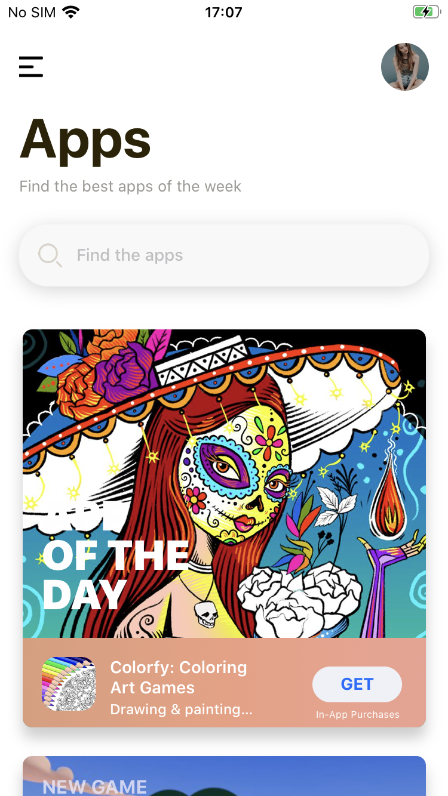
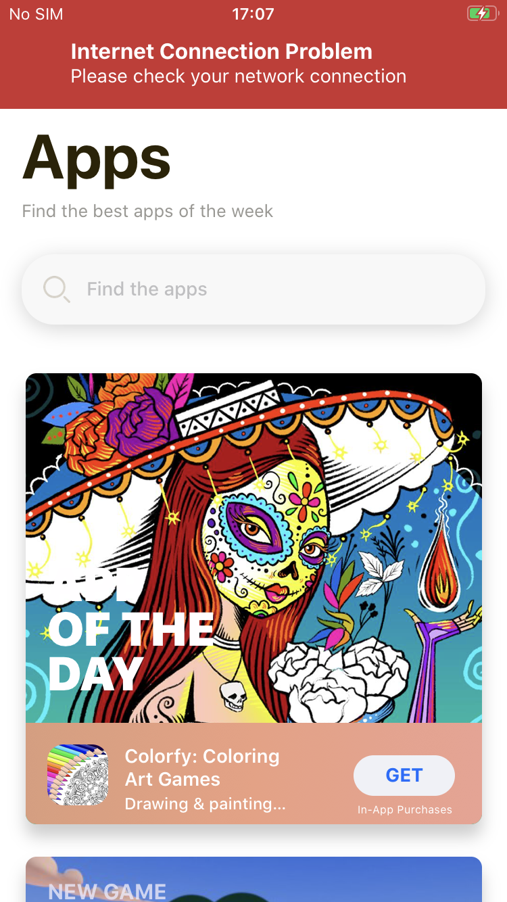

[](https://github.com/WrathChaos/react-native-internet-connection-alert)

[](https://github.com/WrathChaos/react-native-internet-connection-alert)

[](https://www.npmjs.com/package/react-native-internet-connection-alert)
[](https://www.npmjs.com/package/react-native-internet-connection-alert)

[](https://opensource.org/licenses/MIT)
[](https://github.com/prettier/prettier)

<p align="center">
  
</p>

<p align="center">
  
  
</p>

# Installation

Add the dependency:

```bash
npm i react-native-internet-connection-alert
```

## Peer Dependencies

<h5><i>IMPORTANT! You need install them</i></h5>

```js
"react-native-dropdownalert": "=> 4.5.1",
"@react-native-community/netinfo": "=> 8.3.0"
```

# Usage

## Import

```jsx
import InternetConnectionAlert from "react-native-internet-connection-alert";
```

## Fundamental Usage

<i>I **strongly suggest** that cover **whole applicatio**n with **InternetConnectionAlert** component it will handle itself and be able to shows the built-in alert on your whole application. Otherwise, just cover the screen where you need to use this library.</i>

```jsx
<InternetConnectionAlert
  onChange={(connectionState) => {
    console.log("Connection State: ", connectionState);
  }}
>
  {/* {... Your whole application should be here ... } */}
</InternetConnectionAlert>
```

# Configuration - Props

| Property                |       Type        |               Default                | Description                                                                                               |
| ----------------------- | :---------------: | :----------------------------------: | --------------------------------------------------------------------------------------------------------- |
| onChange                |     function      |              undefined               | if you need the connection state when it is changed, you can use this function                            |
| type                    | DropdownAlertType |                error                 | Use some of the prepared dropdown types or if you want to use **your own customization** set **'custom'** |
| title                   |      string       |     Internet Connection Problem      | to change the title of built-in alert                                                                     |
| message                 |      string       | Please check your network connection | to change the message of built-in alert                                                                   |
| useInternetReachability |      boolean      |                false                 | to change the check for connection state to use internet reachability                                     |

### Everything is customizable on built-in dropdownalert. Simply please look at the [React Native Dropdown Alert](https://github.com/testshallpass/react-native-dropdownalert)

## Future Plans

- [x] ~~LICENSE~~
- [ ] Write an article about the lib on Medium

## Author

FreakyCoder, kurayogun@gmail.com

## License

React Native Internet Connection Alert is available under the MIT license. See the LICENSE file for more info.
